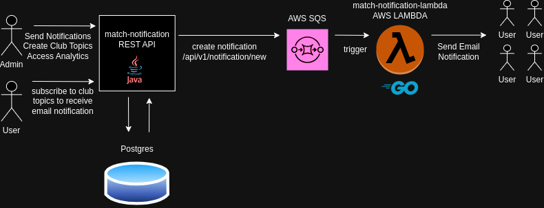

# Match Notification API
<table>
<tr>
<td>
    Send email notification to users that are subscribed to a soccer club topic. Users can receive news, daily-matches and goal notifications.
</td>
</tr>
</table>


## Demo
API Demo: https://match-notification-service.onrender.com/


## Backend Overview



### Go AWS Lambda Repository
Lambda: https://github.com/ccallazans/match-notification-lambda


## Usage

### Development
- Clone the repo
- Create a .env file containing the env variables:
```
AWS_ACCESS_KEY_ID=
AWS_SECRET_ACCESS_KEY=
AWS_REGION=
SQS_NOTIFICATION_QUEUE=
DATABASE_URL=jdbc:postgresql://postgres:5432/notification
DATABASE_USER=postgres
DATABASE_PASSWORD=postgres
```
- Run `docker compose up -d`
- Server will start on port `8080`

### OPENAPI
OpenAPI: http://localhost:8080/swagger-ui.html

#### Top endpoints
/api/v1/subscriptions/new
```
POST request body
{
    "email": "email@email.com",
    "topics": ["BAHIA","VITORIA","BRASIL"]
}
```
/api/v1/notifications/new
```
POST request body
{
    "topics": [
        "BAHIA","BARCELONA"
    ],
    "type": "GOAL",
    "message": "BAHIA GOAL!\nEveraldo scores!\nParcial Result: BAHIA [3]x0 BARCELONA"
}
```

## License

MIT

